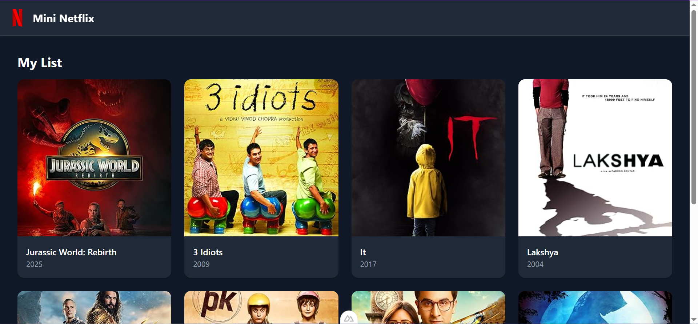
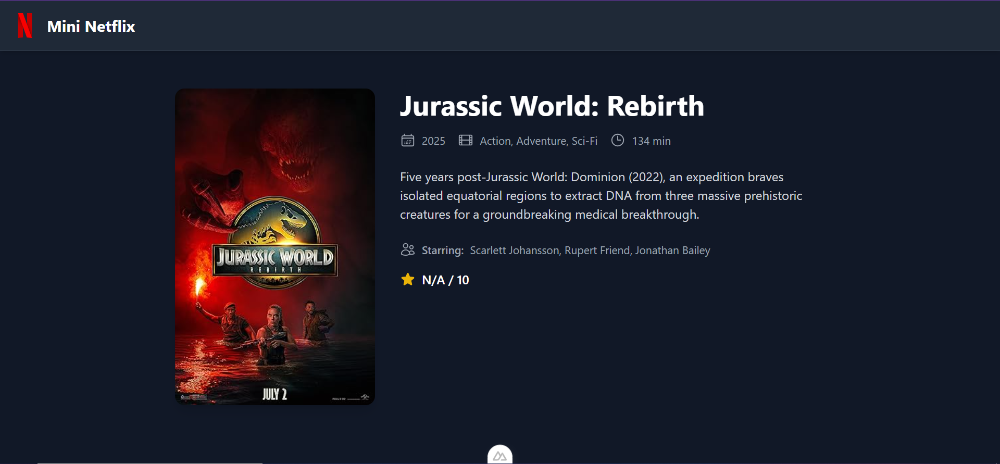

# Mini Netflix – Vue/Nuxt Coding Exercise

A simple and responsive Mini Netflix clone built with **Nuxt 3**, **Vue.js**, and **Tailwind CSS**, using the **OMDb API** to fetch movie data.

---

## Features

- Browse a list of movies with posters and release years
- View movie details
- Skeleton loaders for improved UX during API calls
- Responsive UI with Tailwind CSS
- Accessible (WCAG-focused) with semantic HTML and proper ARIA attributes
- Nuxt server route to proxy OMDb API calls (hides API key)

---

## Tech Stack

- Nuxt 3
- Vue 3
- Tailwind CSS
- OMDb API
- Heroicons

---

## Screenshots

### Homepage (Movie List)


### Movie Details



---

## Getting Started

### Install dependencies

```bash
# npm
npm install

# Or yarn
yarn install
```

### Start Development Server

```bash
# npm
npm run dev

# Or yarn
yarn dev
```

Visit `http://localhost:3000`:

### Build for Production

```bash
# npm
npm run build

# Or yarn
yarn build
```

Preview production build locally:

```bash
# npm
npm run preview

# Or yarn
yarn preview
```
